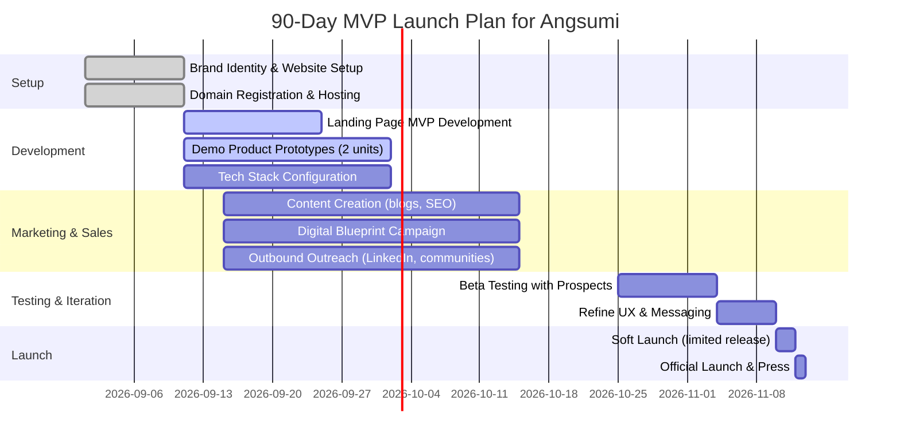

# Executive Summary  
Angsumi will position itself as a **full-stack digital transformation partner** for local Indian businesses – not just a web design shop.  Its core promise is **“Your digital infrastructure, in one place”:** websites, apps, booking/ERP systems, hosting, publishing, and ongoing support all under one roof. By combining clinic portals, school/admissions platforms, e‑learning systems, and SME websites, Angsumi meets booming demand in India’s underserved Tier‑2/3 markets.  India has **6.3 crore MSMEs** (63 million) many in smaller towns, and **over 47 crore telemedicine consultations** have been delivered via national platforms.  In education, government initiatives like DIKSHA and smartphone growth have driven billions of learning sessions and made online admissions mainstream.  Together, these trends mean doctors, schools, teachers, and local SMBs urgently need affordable digital systems (appointment scheduling, student portals, fee collection, e‑commerce, etc.) that Angsumi can provide.  

Angsumi’s **unique value propositions** will be:  
- **Industry-tailored solutions:** Productized “engines” for clinics (ClinicOS), schools (SchoolOS), e‑learning (LearnOS), and SMBs (BusinessOS). This lets clients see live demos and validates Angsumi’s credibility.  
- **End-to-end service:** From domain registration through design, development, publishing (App Store/Play Store), to maintenance & analytics. Clients avoid juggling multiple vendors.  
- **Transparent pricing & agile process:** Clear tiered packages (e.g. “Website Launch”, “Growth App”, “Enterprise Platform”) with feature checklists, plus a free “Digital Blueprint” diagnostic to generate leads.  
- **Local market expertise:** Emphasize Indian context (multi-language support, UPI payments, ONDC readiness, DPDP compliance, GST/PAN integration), which generic global agencies lack.  

By following landing-page best practices (clear hero headline, single primary CTA, social proof, etc.) and SEO/SEM tactics, Angsumi will convert visitors into qualified leads. Key metrics include a **2–5% form fill rate** (rising to 8–15% for top performers), low bounce rate (fast site load), and an inbound pipeline from content offers (like free consultations). A 90‑day launch plan (mermaid chart below) focuses on branding, MVP website/app development, content marketing (“Digital Blueprint”), and early customer trials. 

In sum, Angsumi’s website will convey trust and professionalism (citing credible sources and case studies where possible), explain clearly *who* Angsumi serves (doctors, schools, teachers, SMBs), *what* solutions are offered (websites, portals, apps, video/data services, hosting), and *how* clients get started (lead form, sample projects, pricing). With rigorous UX copy and a modern design system, the landing page will be both informative and conversion‑focused, setting Angsumi on a fast path to winning its first clients.  

## 1. Market Analysis – Target Audiences  

- **Doctors & Clinics:** India’s healthcare sector is rapidly digitizing under initiatives like Ayushman Bharat (ABHA digital health IDs for 40% of population, 36K+ hospitals empaneled). Public telemedicine platforms logged **47 crore (470 million) consultations** by 2026. Yet many small clinics lack basic online presence or patient portals. Angsumi will target individual practitioners, polyclinics, and medium hospitals, offering sites with appointment booking, e‑prescriptions, and patient records. (Hospitals are stable businesses ready to invest, while local clinics will start with website+WhatsApp integrations.)

- **Schools & Educational Institutions:** India has ~15 lakh (1.5 million) K‑12 schools, plus thousands of colleges. Competition is fierce: modern schools tout tech-savvy branding. Digital admissions and management systems are now expected. (For example, a 2026 report notes Indian schools gain an edge by offering online admission and fee payment.) There’s strong demand for K‑12 and coaching centers to automate admissions, fees, attendance, and parent communications. Angsumi will serve both private schools (startup Tier‑II chains, etc.) and individual educators (e.g. coaching institutes, tutors) by building responsive websites, LMS portals, and mobile apps. India’s national DIKSHA platform logged **5,749 crore learning minutes** and 15 cr (150 million) course enrollments, showing huge acceptance of digital learning tools.

- **Teachers & Course Creators:** Beyond formal schools, India’s “edupreneur” segment (online tutors, vocational trainers, upskilling platforms) is growing. These users need course-creation platforms with video hosting, payment gateways, and engagement features. (India’s edtech market is projected to hit tens of billions USD by 2030.) Angsumi’s LearnOS template – a white-label video-learning platform with user accounts, quizzes, certificates – will appeal here. 

- **Local SMBs (Tier‑2/3 Enterprises):** India’s 63M+ MSMEs now widely use digital tools (UPI, WhatsApp Business, Google Maps, social media, ONDC) to grow. Many lack even a basic website. Typical businesses include retailers, clinics, salons, agricultural services, and local manufacturers. These clients want affordable websites, e‑commerce or booking modules, and support. Data shows **60%+ of India’s new tech startups and MSME registrations come from non-metros**. Angsumi will offer simple “starter” web packages (responsive sites, email integration) and upsell to monthly marketing/maintenance plans.  

**Key market trends (India-specific):** Mobile/internet penetration is ~85% nationwide. Digital literacy and smartphone usage are high even in small towns, so cloud-based SaaS tools work. Government Digital India schemes (GSTN, ONDC, UPI) mean clients often need things like integrated payments, tax-compliant invoicing, or ONDC e-commerce setup. We’ll emphasize local payment options (Razorpay/UPI) and mention compliance: “Udyam/MSME registration integration, DPDP privacy compliance, ADR guidance.”

## 2. Value Propositions & Messaging Hierarchy  

Angsumi’s messaging must be crystal-clear. Primary headline ideas:  
- *“Your business deserves more than just a website.”* (Focus on digital **platform**.)  
- *“All the digital tools for your clinic/school/company in one place.”*  
- *“One partner for websites, apps, and ongoing support.”*  

**Core value statements (to be featured on hero section and key cards):**  
- **Industry Expertise:** “We understand clinics, schools, and small businesses – and build systems that make your work easier.”  
- **End-to-End Service:** “From domain to app store to maintenance: every step handled, so you can focus on patients, students, or customers.”  
- **Proven Solutions:** “Demo-ready templates (ClinicOS, SchoolOS, etc.) mean faster launch and lower cost.”  
- **Transparent Pricing:** “Packages for startups to enterprises, pay only for what you need. No hidden fees.”  
- **Growth Focus:** “Our sites and apps aren’t just pretty – they’re built to drive appointments, admissions, and sales.”  

**Secondary messages (beneath headlines or features):**  
- “Reduce paperwork: automated appointments, reports & fees (Doctors/Schools).”  
- “Engage customers: online portals with instant notifications (Clinics/SMBs).”  
- “Publish courses: host videos & sell classes on mobile-friendly platforms (Educators).”  
- “Secure & Compliant: Data protection built in (DPDP, clinical data privacy).”  

Use social proof/logos if available (for example, any pilot clients or known partners), and highlight the “free digital blueprint” (a marketing lead magnet) as a sub-CTA: “Not sure what you need? Get a **free 15-min Digital Blueprint** – our experts audit your current setup and suggest improvements at no cost.”  

## 3. Landing Page Content & Structure  

### Navigation & Header  
- Logo at top-left. Menu: **Home, Industries, Solutions, Pricing, About, Contact**. Language toggle if needed (English/Hindi? But start with en-US).  
- “Contact” and a prominent **Get a Quote** button visible on top.  

### Hero Section  
**Headline:** *“More Than a Website – A Complete Digital Platform for Your Business.”* (Subheadline: “Websites, Apps, Portals, Hosting and Support – All Handled.”)  
This immediately positions Angsumi beyond a simple site builder.  
**Visual:** A clean illustration or photo of people using multiple devices, or an example UI (e.g. ClinicOS dashboard). For example: 

 *Figure: Modern website/app UI on tablet. A professional, clean interface conveys trust and technical capability.*  

**Bullet/Subtitle:** “Whether you run a clinic, school, coaching center, or small business, Angsumi builds the online systems you need: appointment booking, student admissions, video courses, e-commerce, and more – without the technical headache.”  
**Primary CTA button:** “Get My Digital Blueprint →” (opens lead form modal).  
**Secondary CTA:** “See Demo Platforms” (scrolls to Demo section).

### Industries / Use Cases Section  
A row of cards or icons for **Healthcare (Clinics & Doctors)**, **Schools & Education**, **Teachers & Courses**, **Local Business (SMBs)**. Each card with an icon (e.g. stethoscope for healthcare, school building, book or teacher, shop-front) and 1‑2 lines of microcopy:  
- **Healthcare / Clinics:** “Online appointments, patient portals, e‑prescriptions & teleconsultation. Let patients book you 24/7.”  
- **Schools & Coaching:** “Admissions, fee payments, attendance & communication – a unified school management system.”  
- **Educators & Coaches:** “Turn knowledge into revenue: your own branded learning app with video courses, quizzes, and certificates.”  
- **Small Businesses:** “Professional websites, online catalogs and booking tools to take your shop or service digital.”  

Each card’s CTA could link to a relevant section or expand with an image. This establishes Angsumi’s focus areas.  (“Learn more →” on each or “View Demo”.)

### Solutions / What We Do  
A section titled “Solutions & Services”. Use a two-column layout or icon grid with short paragraphs:  
- **Websites & Portals:** “Responsive websites (HTML5/CSS) or web apps (React/Angular) designed for conversion. Includes CMS for easy updates.”  
- **Mobile Apps (Android/iOS):** “Native/Flutter apps for bookings, student access or learning on-the-go.”  
- **Custom Systems:** “Booking systems for clinics, school ERPs (admissions, fees, attendance), e-learning platforms – tailored to your workflow.”  
- **Domain/Hosting:** “We handle domain registration, SSL, and reliable cloud hosting (AWS/Google) so you don’t worry about uptime.”  
- **Maintenance & Support:** “Monthly retainer packages for updates, backups, security, and SEO – we keep your platform running smoothly.”  

Each solution item can have a “Learn more” link to a deeper page (if developed) or simply a hover effect.

### Demo Platforms  
Use this section to introduce **ClinicOS, SchoolOS, LearnOS, BusinessOS** as “example products”. For each, include:  
- A screenshot or mockup (could be a cropped image of a dashboard or homepage).  
- A brief list of key features.  
- A short use-case sentence.  

Example layout (could be tabs or cards):  

- **ClinicOS (Clinics & Doctors):** Appointment calendar; patient record management; SMS/WhatsApp reminders; billing & receipts; prescription pad; telemedicine integration. *“Example: Dr. Sharma uses ClinicOS to manage her appointments and patient history from one dashboard.”*  
- **SchoolOS (Schools & Coaching Centers):** Online admissions form; fee invoicing & payment gateway; attendance via mobile app; parent/teacher portal; academic reports; notifications and SMS alerts. *“Example: ABC School cut admin time by 50% by shifting admissions and fee collection online.”*  
- **LearnOS (Course Creators):** Content authoring (videos, PDFs, quizzes); course catalog & enrollment; payment integration (Stripe/Razorpay); certificate generation; student progress tracking; mobile apps for students. *“Example: A local IIT-JEE coach launched a paid Android app course and saw 30% more enrollments.”*  
- **BusinessOS (SMBs):** Template-based website with product/service catalog; online booking or reservation system; blog/announcements; contact forms; social media integrations; Google Business listing support. *“Example: A neighborhood salon started scheduling via our WebApp, filling 25% more slots.”*  

(If images are embedded, cite them here. Otherwise describe and list features clearly. Bullet lists are good for readability.)  

### Process / How It Works  
An ordered list or infographic of Angsumi’s workflow: 

1. **Consult & Plan:** Free “Digital Blueprint” audit. We discuss your needs and map the requirements.  
2. **Design & Prototype:** Wireframes and UI design for your approval. Responsive design with your branding.  
3. **Develop & Test:** Build the platform (website, portal, app). We iterate quickly, using productized templates where possible to save time.  
4. **Launch:** Deploy your site/app to hosting and app stores. We configure domains, SSL, analytics and SEO basics.  
5. **Support & Grow:** Ongoing maintenance plans, updates, and marketing support to maximize ROI.  

Use simple icons (magnifying glass, design pencil, code symbol, rocket, gear). Include a callout to “Version 1.0 in 90 days” or similar if applicable.

### Pricing & Packages  
A **comparison table** of tiered packages. Example:  

| **Plan**                | **Features (One-time)**                     | **Monthly** | **Best For**                 |
|-------------------------|---------------------------------------------|-------------|------------------------------|
| **Starter Website**     | One-page or basic multi-page site, CMS, mobile‑friendly, contact form, basic SEO | –           | Local shops, consultants, one-man businesses – create an online presence (₹5–10K) |
| **Business Web Portal** | ~5–8 pages, blog/news, lead forms, analytics, SSL, email setup | –           | Service businesses, clinics, schools – start generating leads (₹20–50K) |
| **Digital Platform**    | All Business features **plus** booking system/ERP functionalities, payment integration, mobile apps (web+Android) | –           | Growing clinics/schools – need bookings/education tools (₹1–5L) |
| **Custom Enterprise**   | Fully custom dev, integrations (e.g. ONDC, ERP), multi-language, advanced features | –           | Large organizations – complex workflows and scale (₹5L+) |
| **Maintenance Plan**    | Includes updates, backups, support, minor edits  | ₹5K–15K/mo  | Depends on site size; we’ll tailor a SLA after launch |

*(Include actual currency: ₹1L = 100,000 INR. Note that websites can be very affordable; even a professional site often costs <₹50K, while apps run into lakhs.)*  

Add a note below: “**All prices are indicative.** We create a custom quote based on your exact needs. Our goal: deliver maximum value at each stage.”  

### FAQ  
Use an accordion or simple Q&A format. Example questions:  
- **Q:** *How much does a website/app cost?*  
  **A:** That depends on complexity. Small brochure sites start around ₹10–20K. More advanced systems (booking, multi-page portals, mobile apps) typically run into lakhs (₹2–5L). We work with you to match your budget and needs, and offer phased development.  
- **Q:** *Will I have to pay monthly hosting fees?*  
  **A:** You only pay for what you use. We handle hosting setup (often on affordable cloud services) and can include hosting/maintenance in a monthly plan. Typically, small sites need ~₹2–3K/month, while larger apps or those with video hosting might be ₹5–10K+/month (see maintenance section).  
- **Q:** *Can we translate the site to local languages?*  
  **A:** Absolutely. All Angsumi platforms can support multiple languages (Hindi, Tamil, etc.) as needed.  
- **Q:** *How long until launch?*  
  **A:** A simple website can be live in a few weeks. A full platform (e.g. with apps and ERP modules) may take 2–3 months. We’ll give you a detailed timeline in our proposal.  
- **Q:** *Do you help publish on Google Play / App Store?*  
  **A:** Yes – we handle everything from developer account setup (₹25 fee on Google, ₹7.5K/yr on Apple) through app listing, privacy compliance, and rollout. (See our checklist below.)  
- **Q:** *What about data privacy and security?*  
  **A:** We build with India’s new DPDP Act (2023) and healthcare rules in mind. Any personal data (health records, student info) is encrypted at rest, stored on secure servers, and access-controlled. We can help draft privacy policies.  

### CTAs & Lead Capture  
Throughout the page and especially at bottom:  
- **Primary CTA:** “Get My Free Blueprint”. This triggers a lead form (name, email/phone, business type, needs, message). Keep form short: *“Name, Phone/Email, Business Type (dropdown), I need: [ ] Website [ ] Mobile App [ ] Management System [ ] Other, Comments.”*  
- **Secondary CTAs:** “Talk to an Expert”, “See Pricing & Plans”, “Try a Demo”. Each can scroll to relevant section or open a popup.  
- Final block: “Ready to get started? Contact us or fill the form above for a free consultation.” Include icons: phone number, email, or “Chat via WhatsApp” with a link.  

## 4. Visual & Design System  

 *Figure: Clean, modern UI with bright, neutral design. Our design system will favor spacious layouts, legible fonts, and meaningful imagery (e.g. people interacting with apps, students in class, a smiling doctor in clinic).*  

- **Color Palette:** Light neutral background (white or very light gray) with one or two accent colors (e.g. deep blue or emerald green as primary CTA color, and a warm accent like orange or teal). These convey trust and vitality. Avoid overly flashy gradients; keep it professional.  
- **Typography:** Choose a clean, readable sans-serif (e.g. **Inter**, **Manrope** or **Mulish**) for body text; use a bold variation for headings. Ensure good size contrast (e.g. 40px H1, 24px body) for readability.  
- **Imagery:** Use real photos or high-quality illustrations that reflect the target users: doctors with patients, teachers with students, entrepreneurs in small shops, etc. Also use screenshots/mockups of the demo products (ClinicOS dashboard, etc.) to build credibility. Avoid generic stock photos of “hands shaking”; show contextual scenes.  
- **Iconography:** Use simple line icons (FontAwesome or Material icons) for features (e.g. calendar for appointments, video camera for e-learning, gears for maintenance). Icons should match the line weight of typography.  
- **Motion/Animation:** Subtle UI animations (e.g. smooth scroll, button hover effects, counter flips) can delight users. For example, animate key metrics in view (number of clinics served, appointment booked, etc.) with a counter effect. But maintain fast load times.  
- **Layout:** Responsive grid (bootstrap-like). Mobile-first: on phones collapse columns, ensure buttons are full-width and big enough to tap. Sticky header with menu icon. Use ample white space so content isn’t cramped. Keep paragraphs ≤3 lines and break up text with bulleted lists (as done above).  

## 5. UI/UX Patterns & Mobile Behavior  

- **Hero CTA always visible:** A “Get Blueprint” button in the hero and also as a sticky footer CTA on mobile.  
- **Single Primary CTA:** Focus each screen on one main action. Avoid multiple conflicting buttons (conversion stats show single-CTA pages convert 29% better).  
- **Fast load:** Aim for <2s load time on mobile. Use compressed images, lazy loading, and a CDN. (Research shows 1s load converts 3× better than 5s.)  
- **Mobile navigation:** Hamburger menu. Each major section (Industries, Solutions, Pricing, Contact) can be a single-page scroll target.  
- **Forms:** Use floating labels and only *essential* fields (4–5 max) to reduce friction (over 80% abandon long forms). E.g. Name, Contact, Business Type, Brief Message. Mark required fields clearly.  
- **Sticky menu/CTA:** On scroll, a small header with company logo and “Get Quote” button can remain pinned.  
- **Accessibility:** High-contrast text, alt tags on images, semantic HTML. Readable fonts and ensure clickable elements have padding. 

## 6. Demo Product Specifications & User Flows  

**ClinicOS (Clinic Management Portal):**  
- **Features:** Online appointment scheduling (calendar view for doctors); SMS/email reminders; digital patient profiles (history, prescriptions, invoices); teleconsultation integration (eSanjeevani link or Zoom); inventory for meds; reports (daily revenue, no‑show rate); clinic announcements.  
- **User Flow (ClinicOS):** *Doctor logs in on mobile/tablet → views today’s appointments → confirms appointment (triggers reminder) → after visit, enters consultation notes and e-prescription → payment recorded in system → patient receives automated visit summary via email/WhatsApp.*  
- **Patient App (or portal):** Patients can browse available slots, book/modify appointments, view past records, and pay bills online. They get notifications and can fill intake forms.  

**SchoolOS (School Management System):**  
- **Features:** Web-based admission form (with conditional sections); administrator dashboard (manage applications, shortlist, generate admission letters); online fee module (payment gateway, receipt generation, fee balance); RFID/QR attendance via student app; homework assignments and noticeboard; teacher portal (class schedules, grade entry); parent portal (view child progress, pay fees, permission forms).  
- **User Flow (SchoolOS):** *Parent completes online admission form → admin reviews in SchoolOS → parent receives email/SMS to pay fees online → system generates student login → on first day, teacher marks attendance via app → teachers post grades/notes in portal → parent logs in to view performance and upcoming events.*  
- **Integration:** Data flows into a unified student database. E.g., once admitted, records auto-populate into attendance and fee modules, eliminating duplicate entry.  

**LearnOS (E-Learning Platform):**  
- **Features:** Instructor dashboard (create courses with sections, upload videos/PPTs, set quizzes); student dashboard (browse courses, track progress, earn certificates); video hosting (secure streaming via Vimeo or AWS); payment integration for paid courses; discussion forums or Q&A per lecture; analytics (completion rates, quiz scores).  
- **User Flow (LearnOS):** *Instructor uploads a new course on portal → configures price and launch date → students see it listed and enroll → enrolled student logs in mobile app → watches video lessons, takes quiz → progress bar and certificate upon completion.*  

**BusinessOS (Generic SMB Platform):**  
- **Features:** Responsive website template (company info, gallery, services); lead capture form (built-in CRM); online booking or store (WooCommerce or custom, with Razorpay/Instamojo payments); chat integration (WhatsApp/Chatbot widget); Google Business Profile management (setup consulting); blog/SEO pages.  
- **User Flow (BusinessOS):** *Customer finds local shop via Google → clicks “Book Now” on site → selects service/time and pays deposit → appointment syncs to shop’s calendar; customer gets confirmation SMS. Business owner logs into dashboard to see bookings, sales, and visitor analytics.*  

## 7. Productized Templates & Technical Stack Recommendations  

**Productized Templates:** To accelerate delivery, build starter templates for each vertical (Clinic, School, Learning, Business). These are pre-built codebases with common features (appointments, forms, payment modules, etc.) that can be configured per client. For example:  
- *ClinicOS template:* Node.js + React/Next.js web portal, with Firebase backend for data and authentication. It includes a Calendar component and PDF generation for receipts.  
- *SchoolOS template:* Laravel (PHP) or Django (Python) with React admin panel, MySQL/Postgres DB. Has modules for Admissions and Fee.  
- *LearnOS template:* React/Next.js frontend with a Headless CMS (Strapi or Contentful) for courses, and uses Vimeo or Cloudinary for secure video streaming. Backend can be Node.js or Django.  
- *BusinessOS template:* WordPress or CMS (for rapid site creation) plus custom plugins for booking/e-commerce.  

**Suggested Tech Stack:**  
- **Frontend:** React (with Next.js) for web apps; Flutter for cross-platform mobile (Android, iOS). Flutter can cut costs ~30–40% compared to separate native apps.  
- **Backend:** Node.js/Express (JavaScript) or Django/Flask (Python). Use REST or GraphQL APIs.  
- **Database:** Firebase Firestore or MongoDB for NoSQL ease, or PostgreSQL for relational data (e.g. fee payments). Firebase Auth for user login can speed up dev.  
- **Video:** Vimeo Pro (allows private video apps), YouTube (for public content), or AWS Elemental (for in-house streaming). Even a channel with unlisted videos embedded can be used initially.  
- **Payments:** Razorpay or PayU for Indian market (supports UPI, cards, wallets), or Stripe if clients have international users.  
- **Hosting:** AWS (Lightsail/EBS) or Google Cloud (Cloud Run) for scalability. For smaller sites, Vercel (for Next.js) or Netlify (static sites) + daily AWS Lambda jobs for tasks. Use Cloudflare CDN for speed/Security (free tier available).  
- **Authentication/Permissions:** Firebase Authentication or Auth0 for ease; ensure token encryption.  
- **Domain & Email:** Encourage clients to buy custom domains (Google Domains/Godaddy ~₹800/yr). Set up G-Suite (₹1500/yr) or Zoho Mail for professional email.  
- **DevOps:** GitHub/GitLab CI for deployments. Dockerize applications. Set up automated backups (e.g. daily DB dumps).  
- **Monitoring:** Google Analytics and Facebook Pixel for traffic. Use Google Search Console for SEO. If app heavy, use Firebase Crashlytics.  
- **Project Management:** Use Agile sprints (weekly tasks), shared docs (Google Drive), and regular client demos via Zoom.  

By standardizing on modern, well-supported tech, Angsumi can ensure maintainability. For example, **Firebase’s free Spark plan** can cover proof-of-concept stages, with pay-as-you-go (Blaze) later. The stack choices also align with rapid development trends (React/Node, Flutter) to meet the 90‑day MVP goal.

## 8. App Publishing & Compliance Checklist  

When delivering mobile apps, Angsumi must handle publishing:  

**Google Play Store (Android):**  
- Register a Google Play Developer account (₹1,500 one-time). For an organization account (highly recommended), obtain a **D‑U‑N‑S number** (free) and list official business details.  
- Prepare assets: app icon (512×512), feature graphic (1024×500), and 3–4 screenshots per device type (phone/tablet). Provide an app title, short/long description, and promotional video if any.  
- Privacy/Data Safety: complete the Play Data Safety form, disclosing all data collected (e.g. user location, health info). Include a hosted **Privacy Policy** URL that covers DPDP compliance (consent, usage, storage). Mention encryption and limited data retention.  
- Generate signed app bundle (.AAB) with proper versioning. Test internal build.  
- Submit for internal testing first, then open testing, then production rollout. Target India and any other regions.  
- After publishing, enable “staged rollout” (e.g. 20% first) to catch issues, then scale to 100%.

**Apple App Store (iOS):**  
- Enroll in Apple Developer Program (~$99/year ≈ ₹8,000). This requires an Organization or Individual account (Organization needs DUNS and legal entity details).  
- Create an App ID, provisioning profile and upload via Xcode or Transporter.  
- Prepare App Store listing: app name, subtitle, keywords, support URL, marketing URL (company site), category, and content rating. Add privacy policy and compliance info (e.g. if collecting health data).  
- App Store Connect: Upload screenshots (6 per orientation), an app icon (1024px), and a preview video optional. Answer the “Data Safety” questionnaire (similar to Google’s form).  
- Review guidelines: Ensure no disallowed content (e.g. adult, gambling, unsupported health claims). Guarantee app works as advertised (Crashes or placeholder apps get rejected).  
- Submit for review. Typical turnaround is a few days.  
- Maintain app updates: Every time a new feature or fix is ready, submit a new build with release notes.  

**Healthcare/Privacy Compliance:**  
- Patient data: Follow HIPAA-like precautions. On Indian law, explicitly treat medical records as *sensitive personal data* (DPDP Act) – encrypt in transit/at rest, log access. If integrating with ABDM (ABHA IDs), note that it’s voluntary but encourages future integration.  
- DPDP Act (2023) requires **consent** for all personal data. We must have opt-in checkboxes and clear purpose statements for contact forms or app registration. Data breaches must be reported.  
- For student data, mention compliance with any local education board requirements. Children’s data (if applicable) needs parental consent.  

**Ongoing:** Set up Google Play/App Store dashboards to monitor downloads, reviews, crash reports, and ensure 3rd-party libraries (SDKs for payment, analytics, ads) are up-to-date and secure.

## 9. Pricing & Recurring Revenue Models  

- **Initial Revenue (Project Fees):**  
  - **Website Projects:** ₹5,000–50,000+ (as per scale). 
  - **Mobile Apps:** ₹4.2L–12.6L for simple apps; ₹12.6L–25L for moderate complexity. 
  - **Custom Platforms:** ₹2L–5L for combined web+app solutions; more if heavily bespoke.
- **Monthly/Annual Services (Recurring):**  
  - **Maintenance Contracts:** ₹2.5K–30K/month depending on package (basic security/backup to 24/7 support). Common plans:  
    - *Silver:* ~₹5K/mo (minor edits, monthly backup, basic SEO reports).  
    - *Gold:* ~₹12K/mo (weekly updates, speed monitoring, SSL renewal, analytics).  
    - *Platinum:* ~₹25K/mo (daily security, 24/7 support, content creation, advanced SEO).  
  - **Hosting & Domains:** Usually ₹1K–3K/mo or ₹10K–30K/yr, often bundled in maintenance. Cloud services (AWS, Firebase) are usage-based.  
  - **Software-as-a-Service Fees:** If any modules (like SchoolOS) become SaaS, charge per student or per active doctor per month. Example: ₹100/student/year or ₹500/doctor/year for premium features (if scale allows).  
  - **Support/Training:** Ad-hoc hourly rates (₹500–1,500/hr) for feature additions, custom reports, or SEO content.  
  - **Value-Added Reselling:** Commission on domain/hosting (e.g. reseller accounts), or affiliate for tools like Google Workspace.  

By offering bundled retainers (web+app+maintenance), Angsumi can smooth revenue. For example, a small clinic might pay ₹1L one-time for website+appointment app, plus ₹8K/mo support. Similarly, a school might pay ₹3L upfront for portal+apps, plus ₹15K/mo. These create predictable recurring income.  

## 10. Launch Roadmap & 90-Day MVP Plan  

- **Month 1 (Sept):** Finalize branding (logo, colors). Set up website and backend infrastructure. Build the **landing page MVP** (hero, industries, solutions, contact form). Begin developing two demo templates (e.g. a mock ClinicOS and SchoolOS homepage). Configure project tools (Git repo, CI, database).  
- **Month 2 (Oct):** Ramp up marketing: publish 2–3 blog posts (e.g. “Why Clinics Need Online Booking”, “How to Grow School Admissions”), optimize SEO (keywords like “school admission software India”). Launch the **Free Digital Blueprint** funnel (ads or LinkedIn posts inviting sign-ups). Begin reaching out to personal network (clinical schools, small biz meetups). Hold demo calls with 5–10 prospects for feedback.  
- **Month 3 (Nov):** Iterate on site copy/design based on feedback. Test the demo products (use dummy data). Soft-launch the site to limited audience (e.g. email list, partner organizations). Official launch around Nov 10–12 (maybe aligned with Diwali season marketing). Focus on converting leads into first paid projects. After launch, begin delivery of first client project(s). 

## 11. Sales/Lead Gen Tactics  

- **Free Digital Blueprint:** Promote this as a valuable audit (15–30 min call plus PDF report). Prospects sign up via landing page. In the call, identify their bottlenecks and pitch Angsumi solutions.  
- **Content Marketing:** Publish articles and short videos addressing clinic/school pain points (e.g. “5 Ways to Reduce No‑Shows in Your Clinic” or “How Online Admissions Increase Applications”). Share on LinkedIn, WhatsApp groups, local business networks.  
- **Social Proof & Referrals:** Collect testimonials from first clients (“Angsumi helped us fill 50% more seats” etc.). Encourage referrals via referral discount.  
- **Local Partnerships:** Partner with domain/hosting firms or digital literacy NGOs to co-market. List on local business directories, make Google My Business profile.  
- **Paid Ads:** Run targeted Google Ads (keywords like “school management software India”) and Facebook/Instagram ads (for local education/clinic communities), with the blueprint offer as lead magnet.  
- **Community Outreach:** Attend or sponsor local healthcare/edu meetups. Offer free workshops (“Digital Skills for Doctors”) to generate goodwill and leads.  

## 12. KPIs and Conversion Funnel Metrics  

Key metrics to track:  
- **Awareness:** Website sessions (target first month 1,000 visits via SEO & ads), social media impressions.  
- **Engagement:** Bounce rate (<50%), average time on page (>2 minutes), click-through on CTAs.  
- **Lead Generation:**  
  - **Form Conversion Rate:** Aim ~3–5% of visitors submitting the Blueprint form.  
  - **Blueprint Completion:** Rate of scheduled calls / signups (target 50% show rate).  
- **Sales Pipeline:**  
  - Number of quote requests, proposals sent.  
  - Close rate (conversions to paid clients); early-stage goal 10–20%.  
- **Revenue:**  
  - MRR from maintenance/hosting after Month 3.  
  - Total project revenue.  
- **Client Retention:** Renewed maintenance contracts, upsells.  
- **Performance:** Page load speed (target <2s); form submit error rate (<1%).  

Each stage of the funnel (Visit → Lead → Proposal → Customer) should be measured. Adjust marketing spend (CAC) to keep payback <6 months. Early targets might be small (e.g. 3 paid clients by Q1 2027) but growth should accelerate via referrals and recurring work. 

---

**Sources:** Market and design insights from Indian industry reports and best-practice resources.